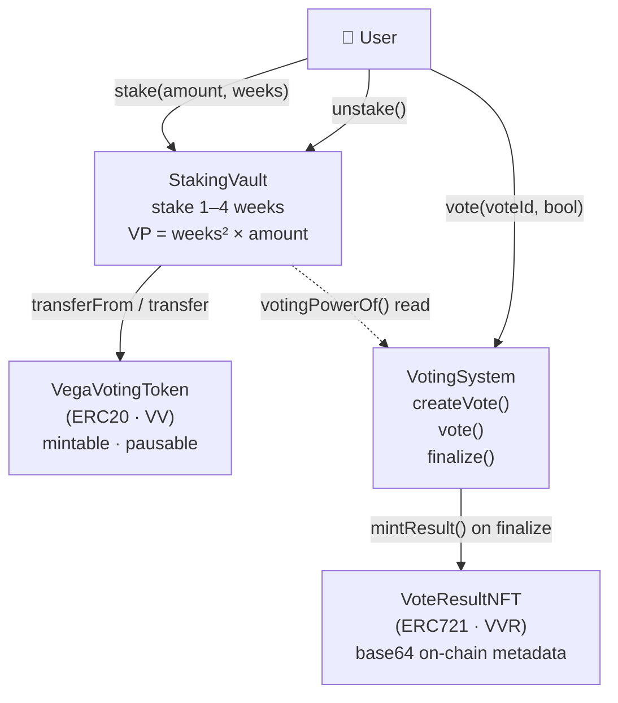

# HW6 — Vega Voting System

Система голосования на Solidity: ERC20 токен, стейкинг с расчётом голосовательской силы, голосование с auto-finalization, NFT с результатами.

## Архитектура



### Формула Voting Power

```
VP(t) = Σ weeksRemaining² × (amount / 1e18)
```

| Стейк | Срок | VP |
|-------|------|----|
| 500 VV | 4 недели | 4² × 500 = **8000** |
| 200 VV | 2 недели | 2² × 200 = **800** |

VP уменьшается каждую неделю по мере приближения к дедлайну.

---

## Контракты на Sepolia

| Контракт | Адрес |
|----------|-------|
| VegaVotingToken (VV) | [0x5cB461D21F79755852a54248E54BdA63e02E3f50](https://sepolia.etherscan.io/address/0x5cB461D21F79755852a54248E54BdA63e02E3f50) |
| StakingVault | [0x989e6c3Fb6A07351679e9893e3A426d9Df2cA42A](https://sepolia.etherscan.io/address/0x989e6c3Fb6A07351679e9893e3A426d9Df2cA42A) |
| VoteResultNFT (VVR) | [0x24aC07C929dbebb24E4F52a6FAE6dDaA7047B32c](https://sepolia.etherscan.io/address/0x24aC07C929dbebb24E4F52a6FAE6dDaA7047B32c) |
| VotingSystem | [0x543C92112Db15796Da6bFa94186bc8065Cd7e4D2](https://sepolia.etherscan.io/address/0x543C92112Db15796Da6bFa94186bc8065Cd7e4D2) |

**Deployer:** `0x0E90693B25ADa770900eC08f7dF548e562C0Ed02`

### Ключевые транзакции

| Действие | Tx |
|----------|----|
| Deploy всех контрактов | [0xcb5f170...](https://sepolia.etherscan.io/tx/0xcb5f17052b0368d2ca824d0d9897f3233bff1856a1bb3442395fc5389c32a333) |
| Stake 500 VV (addr1) | [0xc1e8fb1...](https://sepolia.etherscan.io/tx/0xc1e8fb1688f7e629b4501df14ef74e8b1ca2e0ac840edcdb66087a9c9f3797ef) |
| Vote YES + auto-finalize + NFT mint | [0x5c2b959...](https://sepolia.etherscan.io/tx/0x5c2b959c9b7dc182de422c8cd638879bb91a93e278c4525a0177b0a3e54de5be) |

---

## Структура проекта

```
src/
  VegaVotingToken.sol   — ERC20 "VV", mintable, pausable
  StakingVault.sol      — стейкинг токенов, VP formula, unstake
  VotingSystem.sol      — создание голосования, vote(), finalize()
  VoteResultNFT.sol     — ERC721, on-chain base64 metadata
test/
  VegaVotingToken.t.sol
  StakingVault.t.sol
  VotingSystem.t.sol
  VoteResultNFT.t.sol
  Integration.t.sol
script/
  Deploy.s.sol          — деплой всех контрактов + настройка ролей
  Interactions.s.sol    — хелперы для ручного тестирования
```

## Тесты

```bash
forge test -v
# 40 tests, 0 failures
```

## Деплой

```bash
cp .env.example .env
# заполни PRIVATE_KEY, SEPOLIA_RPC_URL, ETHERSCAN_API_KEY

forge script script/Deploy.s.sol \
  --rpc-url $SEPOLIA_RPC_URL \
  --broadcast \
  --verify \
  --etherscan-api-key $ETHERSCAN_API_KEY
```

## Tech Stack

- Solidity 0.8.24
- Foundry (forge / cast / anvil)
- OpenZeppelin v5 (ERC20, ERC721, AccessControl, Pausable, ReentrancyGuard, Base64)
